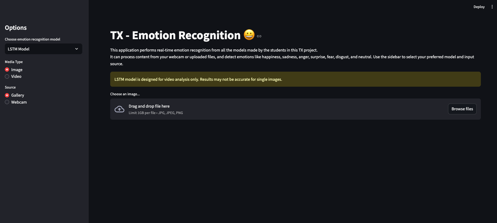

# TX - Emotion Recognition

Real-time emotion recognition application developed as part of a student project at Univeristy of Technology of Compiègne


## Installation

### 1. Install Python dependencies
```bash
pip install -r requirements.txt
```

### 2. Install OpenFace
Clone OpenFace in the same directory as the application:
```bash
git clone https://github.com/TadasBaltrusaitis/OpenFace.git
cd OpenFace
```
Follow the installation instructions for your OS from the OpenFace repository.

## Usage

Run the application:
```bash
streamlit run app.py
```

Open your browser to `http://localhost:8501`

## Requirements

- Python 3.8+
- OpenFace compiled executable
- Model files in `models/lstm/` directory
- Webcam for real-time analysis

## Models

- **LSTM Model**: Advanced sequential analysis (requires OpenFace)
- **Basic Model**: Fallback model for demonstration
The application automatically falls back to basic models if LSTM dependencies are not available.